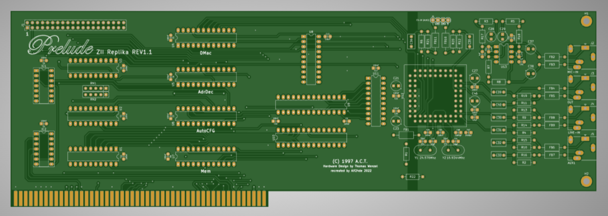
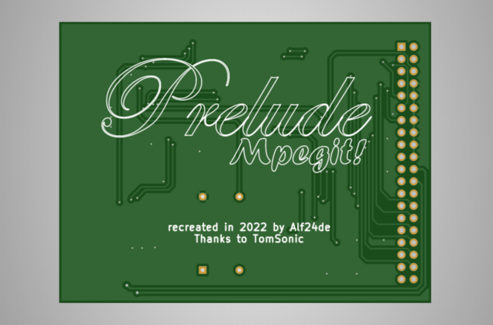

# Prelude ZII Sound Card
A replica of the Prelude ZII sound card for the Amiga.

\

## Info
This is a replica of the Prelude ZII sound card for the Amiga. Original hardware design is by Thomas Wenzel, and the board was replicated by Alf24de. Special thanks to TomSonic.
\
\
Included in this repository is:
* Prelude ZII schematics
* Prelude ZII GAL jed files
* Prelude ZII gerber files
* Mpegit schematics
* Mpegit Mach jed file
* Mpegit gerber files
* STL file for the slot bracket
* Mouser cart for sourcing and ordering components -- [Updated January 2024 Link](https://www.mouser.com/ProjectManager/ProjectDetail.aspx?AccessID=4ca2728ed7)
* Interactive BOM & Placement HTML viewer

## License
The license is included in the repository. The GNU General Public License is a free, copyleft license for software and other kinds of works.

## Note
I am not the creator of this board/project, it is only being hosted here on my Github, so please check the A1k thread for updates or guidance from the community.
\
Original A1k thread: [Link](https://www.a1k.org/forum/index.php?threads/85465/)
\
Original Prelude information: [Link](http://amiga.resource.cx/exp/prelude)
\
Original MPEG-it! information: [Link](http://amiga.resource.cx/exp/mpegit)
\
MPEG-it! software external links:
* AHI 4.18 https://aminet.net/driver/audio/ahiusr_4.18.lha
* Prelude.library 5.6 https://aminet.net/driver/audio/PreludeLib.lha
* mhimpegit 1.1 https://aminet.net/driver/audio/mhimpegit.lha
* Prelude Mixer 2.3 http://www.toms-home.de/Software/Prelude/PreludeMixer23.lha (Mixer must be started once after booting/rebooting the Amiga to enable the AUX-1 input that the MPEG-it! uses)
* AmigaAmp 3.31 (3.32 has a bug in MHI handling that is currently being fixed) http://www.amigaamp.de/Binaries/AmigaAMP331-68k.lha
\
\

